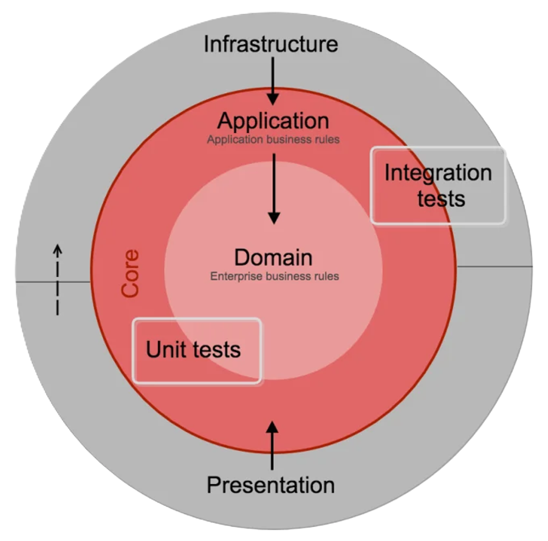
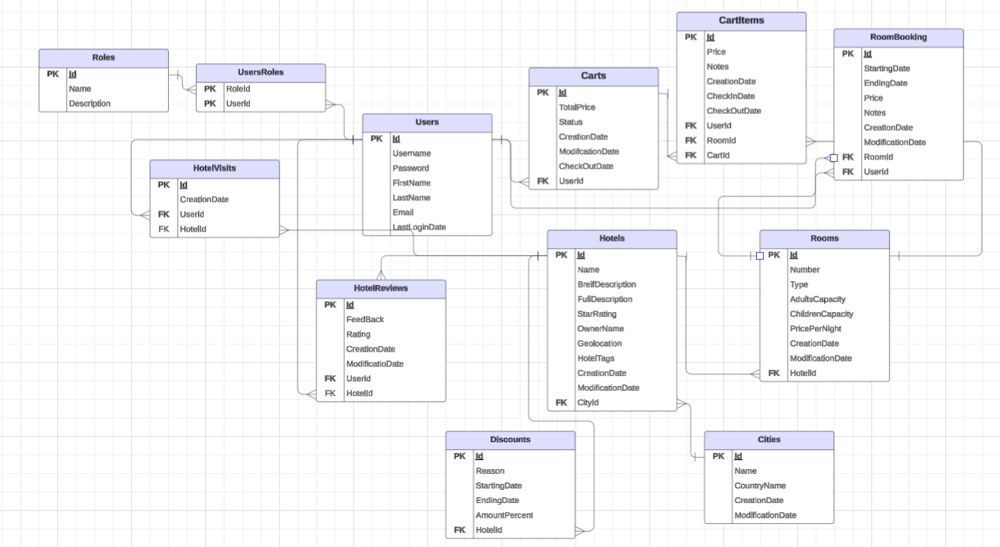

[](https://github.com/v1rushb/Travel-and-Accommodation-Booking-Platform/actions/workflows/build-and-test-on-all-platforms.yml)
# Travel-and-Accommodation-Booking-Platform
Hotel Booking API implemented with ASP .NET Core and built upon the principles of Clean Architecture.
This is the final project of my backend internship at Foothill Technology Solutions.

## Table of Contents

- [Overview](#overview)
- [Features](#features)
- [Technical Features](#technical-features)
- [System Architecture & Design](#system-architecture--design)
- [Tech Stack](#tech-stack)
- [Database Schema](#database-schema)
- [Getting Started](#getting-started-how-to-run)


## Overview
TABP is a Hotel Booking API built using ASP.NET Core and designed following the principles of Clean Architecture.
Main goal of this project is to provide a clean and maintainable solution for hanlding hotel and travel bookings.
It exposes endpoints for booking operations, user interactions and an admin dashboard for managing hotel related data.

## Features

### User Authentication and Authorization
- Regsiteration & Login, Logout: Secure Registeration and Login using JWT for authentication.
- Role-Based Access Control (RBAC): Differentiate between regular users and admins to limit access accordingly.

### Image Management:
- Image handling: Upload and delete images for hotels, rooms and cities.

### Popular Cities:
- Trending Cities: Identify and display cities with high user engagement over a specified period of time.

### Best Deals:
- Trending hotels with best deals are shown in home page.

### Email Notifications:
- Email sending service that sends an email to the user when the user creates a booking containing all of the needed information like total price, exact location for the hotel on the map and other details.
- Facilitates effective communication with users, keeping them informed about their bookings.

### Global Search:
- Global Search:
    Every major entity endpoint supports a global search parameter that allows users to search by common attributes (e.g., hotel name, description, room type, city name, etc.). This search is case-insensitive and can match partial strings.

- Filtering:
    Clients can narrow down search results using multiple query parameters. For example, filtering hotels by price range, room capacity, or amenities is supported by appending filter parameters to the endpoint URL.

- Sorting:
    Results can be sorted based on one or more fields. Typical query parameters include sortBy (to specify the field) and sortOrder (e.g., ascending or descending).

- Pagination:
    To efficiently manage large result sets, endpoints support pagination via parameters like page and pageSize. This allows clients to retrieve results in manageable chunks.

### Admin dashboard:
- Admin dashboard to search, add, update and delete entities.

## Technical Features:
### Password Security:
- Store passwords securely using Microsoft.AspNet.Identity.IPasswordHasher, which uses password salting and hashing to protect sensitive user credentials even if database access is exposed.

### Database Integration:
- Utilize SQL Server as the primary RDBMS, with Entity Framework Core serving as the ORM to simplify data access, migrations, and LINQ queries.

### Robust Data Validation:
- Implement intensive user validations via FluentValidation to enforce data domain rules and ensure consistency.

### Testing:
- Architecture Testing: Verify adherence to Clean Architecture principles and enforce it.
- Application (Service) Testing: Validate the logic and flow of data.
- Integration Testing: Ensure functionality across API endpoints are working as expected.

### Logging:
- Use Serilog for structured logging and instensive logging capabilities.

### Rate Limiting:
- Middleware to limit the number of requests made by some particular IP for a specific time interval to limit user's abusing of requests.

### Consistent API Responses:
- Provide meaningful HTTP status codes and standardized messages to deliver clear feedback to API consumers.

### Clean, Well-Documented Code:
- Adheres to industry best practices with clean, maintainable code and API documentation, which results in an ease of development in the future.

## System Architecture & Design
    

### Core Layers:
- Domain Layer:
    - Contains the shared models and abstractions for business logic.
    - Has no dependency on other layers whatsoever.

- Application Layer:
    - Conatins the business logic implementation which are declared in the domain layer.
    - Implements use cases, user validation, and orchestration of domain logic.
    - Depends on the abstractions in domain layer.
    
### External Layers:
- Infrastructure Layer:
    - Contains the implementation of external services declared in the domain layer, such as repositories, email services, and caching services.
    - Implements persistence logic using Entity Framework Core (or other ORMs).
    - Handle Integration with third party services.
    - Depends only on the abstractions in Domain Layer.

- Presentation (API) Layer:
    - Contains the implementation of APIs that expose the system's functionality.
    - Contains Middlewares, Central Error Handler, etc...
    - Depends only on abstractions on the domain layer.

## Tech Stack
### Programming Languages:
- C#: Primary language of development.

### Backend Framework:
- ASP .NET Core: Framework for building high-performance, cross-platform web APIs.

### Database:
- SQL Server: Used as the primary relational database management system (RDBMS) to store and manage application data.  

- EF Core: Used Entity Framework Core as an Object-Relational Mapper (ORM) to facilitate database interactions in a more of an abstracted and maintainable way. It enables seamless data access, migrations, and LINQ-based querying whcih made my work pretty much easier.

### API Documentation:
- Swagger/OpenAPI: For API specification and documentation.
- Swagger UI: Provides a user-friendly interface for API interaction.

### Authentication and Authorization
- JWT for secure & stateless authentication.

### Monitoring & Logging:
- Serilog: Logging library for .NET applications.

### Set of External Libraries Used:
- AutoMapper
- Serilog
- SixLabors
- FluentValidation
- StackExchange.Redis
- FluentEmail
- FluentAssertions
#### Testing related Libraries:
- xUnit
- AutoFixture
- FluentAssertions
- Moq
- NetArchTest

## Database Schema
    

## Getting Started (How to run)
### Prerequisits:
- .NET 8 SDK (or your specified version)
- dotnet cli
- SQL Server instance
- Redis instance
- Mailing service
- Git

### Step By Step Guide
#### Clone the repository:

```bash
git clone https://github.com/v1rushb/Travel-and-Accommodation-Booking-Platform.git
```
#### Set up Configurations:
Configure appsettings.Development.json to include all your development secrets.
- ConnectionStrings: Configure your DataSource connections.
```json
    "ConnectionStrings": {
    "SQLString": "...",
    "Redis": "..."
    }
```
#### JWT Configurations: Define issuer, audience, and secret key.
```json
  "JwtConfigurations": {
        "Key": "...",
        "Issuer": "...",
        "Audience": "...",
        "ExpirationTimeMinutes": 10
    }
```
#### EmailSettings: SMTP config.
```json
    "EmailSettings": {
      "DefaultFromEmail": "...",
      "SMTPSettings": {
        "Host": "...",
        "Port": 2077,
        "User": "...",
        "Password": "...",
        "EnableSsl": false
      }
    }
```
#### Logging: Serilog configuration details.

#### Run migrations
Before running the application, update the database using the EF Core migrations provided in the Infrastructure layer:

```bash
cd src/TABP.Infrastructure
dotnet ef database update --startup-project ../TABP.API/TABP.API.csproj
```
#### Run the application:
Run locally.

```bash
dotnet run --project src/TABP.API
```

APIs will be accessible locally using: http://localhost:5137/

The swagger UI will open automatically where you can try and explore the endpoints or you can open it using http://localhost:5137/swagger

#### Admin credentials:
- Username: v1rushb
- Password: 12345678Aa@_

## Get Involved
Your feedback & contributions on my project are really welcomed.
### Ways to Contribute
- Feedback: via Email or Linkedin.
- Report bugs: via GitHub.
- Code Contribution: highly doubted but self-explanatory.

## Reach me
Email: cs.bashar.herbawi@gmail.com

Linkedin: [Bashar Herbawi](https://www.linkedin.com/in/bashar-herbawi/)